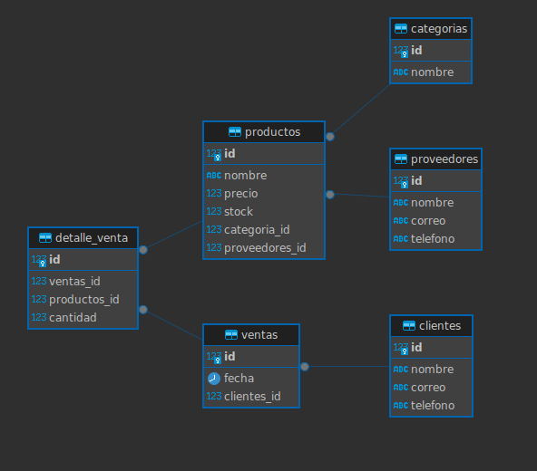

# 🏪 Gestión de Inventario para una Tienda de Tecnología

## 📌 Descripción del Proyecto

Este proyecto consiste en la creación de un sistema de base de datos en **PostgreSQL** para gestionar el inventario, ventas, clientes y proveedores de la tienda **TechZone**. Con esta solución se busca resolver problemas de desabastecimiento, errores en el control de stock, gestión manual de proveedores y ventas, mediante la automatización y análisis de datos clave.

## 🗂️ Estructura del Repositorio

- `modelo_er.png` → Diagrama Entidad-Relación (E-R).
- `db.sql` → Script de creación de la base de datos y tablas.
- `insert.sql` → Script para insertar datos representativos.
- `queries.sql` → Consultas avanzadas en SQL.
- `procedureAndFunctions.sql` → Procedimiento almacenado para registrar ventas.
- `README.md` → Documentación del proyecto.

## 🧩 Modelo Entidad-Relación



## ⚙️ Instrucciones de Uso

1. Abre  una terminal conectada a PostgreSQL.
2. Crea una nueva base de datos llamada techzone.
3. copia y pega las tablas que estan en el archivo db.sql
4. haz la inserccion de las tablas copiando y pegando la informacion del archivo insert.sql

## 📄 Descripción de los Scripts

### `db.sql`
Contiene la creación de las tablas con claves primarias, foráneas y restricciones como `NOT NULL`, `CHECK` y `UNIQUE`.

### `insert.sql`
Inserta al menos 15 registros por entidad con datos realistas de productos, clientes, proveedores y ventas.

### `queries.sql`
Incluye 6 consultas avanzadas:
- Productos con stock < 5.
- Ventas totales de un mes.
- Cliente con más compras.
- Top 5 productos más vendidos.
- Ventas en un rango de fechas.
- Clientes inactivos (últimos 6 meses).

### `procedureAndFunctions.sql`
Procedimiento para registrar una venta:
- Valida existencia del cliente.
- Verifica stock disponible.
- Si no hay stock, muestra error con `RAISE`.
- Si hay stock, registra la venta correctamente.

## ▶️ Ejemplo de Ejecución del Procedimiento

```sql
-- Registrar una venta de 2 unidades del producto 1 al cliente 3
CALL registrar_venta(3, 1, 2);


